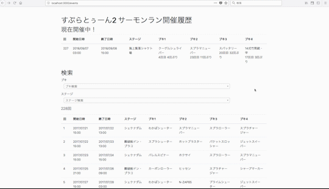

# salmon_run

Splatoon2のサーモン・ランブキ変遷

このリポジトリは非公式のもので、完全に個人的な趣味で作っているものです。

[](https://circleci.com/gh/YutaGoto/salmon_run)
[](https://travis-ci.com/YutaGoto/salmon_run)
[](https://codebeat.co/projects/github-com-yutagoto-salmon_run-develop)
[](https://greenkeeper.io/)
[](https://codeclimate.com/github/YutaGoto/salmon_run/maintainability)
[](https://codeclimate.com/github/YutaGoto/salmon_run/test_coverage)
[](https://www.codacy.com/app/YutaGoto/salmon_run?utm_source=github.com&amp;utm_medium=referral&amp;utm_content=YutaGoto/salmon_run&amp;utm_campaign=Badge_Grade)



## Spec

*   Ruby version: 2.5.1
*   Rails version: 5.2.1
*   PostgreSQL version: 10.5
*   yarn version: 1.12.1
*   Vue: v2.5.17
*   UIkit 3.0.0-rc.19

### tools

*   [CircleCI 2.0](https://circleci.com/)
*   [travisCI](https://travis-ci.org/)
*   [Sider](https://sider.review/)
*   [codebeat](https://codebeat.co/)
*   [Greenkeeper](https://greenkeeper.io/)
*   [CodeClimate](https://codeclimate.com/)
*   [Codacy](https://www.codacy.com/)

## 初期設定

```sh
$ docker-compose build
$ docker-compose run web bin/setup
```

### 起動コマンド

```sh
$ docker-compose up
```

### docker imageの削除

```sh
$ docker-compose down --rmi all
$ docker images
REPOSITORY             TAG                 IMAGE ID            CREATED             SIZE
ruby                   2.5.1               hogehoge1234        6 days ago          869MB
$ docker rmi [IMAGE ID]
```

# サーモンラン とは

*   [サーモンラン | スプラトゥーン2](https://www.nintendo.co.jp/switch/aab6a/coop/index.html)

# 活動報告

*   [Rails5の練習をしている件](https://medium.com/@gggooottto/rails5%E3%81%AE%E7%B7%B4%E7%BF%92%E3%82%92%E3%81%97%E3%81%A6%E3%81%84%E3%82%8B%E4%BB%B6-a9b46a0fb6e5)
*   [Rails5の練習をしている件2](https://medium.com/@gggooottto/rails5%E3%81%AE%E7%B7%B4%E7%BF%92%E3%82%92%E3%81%97%E3%81%A6%E3%81%84%E3%82%8B%E4%BB%B62-d4fdce635bcc)
*   [Rails5の練習をしている件3](https://medium.com/@gggooottto/rails5%E3%81%AE%E7%B7%B4%E7%BF%92%E3%82%92%E3%81%97%E3%81%A6%E3%81%84%E3%82%8B%E4%BB%B63-40398a24e7b1)
*   [Rails5の練習をしている件4](https://medium.com/@gggooottto/rails5%E3%81%AE%E7%B7%B4%E7%BF%92%E3%82%92%E3%81%97%E3%81%A6%E3%81%84%E3%82%8B%E4%BB%B64-a506426e1f71)
*   [Rails5の練習をしている件5](https://medium.com/@gggooottto/rails5%E3%81%AE%E7%B7%B4%E7%BF%92%E3%82%92%E3%81%97%E3%81%A6%E3%81%84%E3%82%8B%E4%BB%B65-da554d093d73)
*   [Rails5の練習をしている件6](https://medium.com/@gggooottto/rails5%E3%81%AE%E7%B7%B4%E7%BF%92%E3%82%92%E3%81%97%E3%81%A6%E3%81%84%E3%82%8B%E4%BB%B66-f0c80e802560)

## Contributing

1.  Fork it!
2.  Create your feature branch: `git checkout -b my-new-feature`
3.  Commit your changes: `git commit -am 'Add some feature'`
4.  Push to the branch: `git push origin my-new-feature`
5.  Submit a pull request :D

## License

MIT
