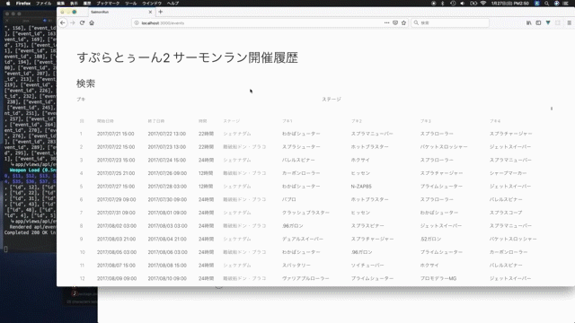

# salmon_run

Splatoon2のサーモンラン ブキ変遷

このリポジトリは非公式のもので、完全に個人的な趣味で作っているものです。

## Spec

*   Ruby version: 2.6.4
*   Rails version: 6.0.0
*   PostgreSQL version: 11.3
*   bundler version: 2.0.2
*   yarn version: 1.16.0
*   Vue: v2.6.10
*   uikit: 3.2.0
*   elasticsearch: 7.1.0
*   graphql: 1.9.9

### tools

*   [CircleCI 2.0](https://circleci.com/)
*   [Sider](https://sider.review/)
*   [codebeat](https://codebeat.co/)
*   [CodeClimate](https://codeclimate.com/)
*   [Codacy](https://www.codacy.com/)
*   [Dependabot](https://dependabot.com/)

## サーモンラン とは

*   [サーモンラン | スプラトゥーン2](https://www.nintendo.co.jp/switch/aab6a/coop/index.html)

## 活動報告

  
Blog List

  <ul>
    <li><a href="https://medium.com/@gggooottto/rails5%E3%81%AE%E7%B7%B4%E7%BF%92%E3%82%92%E3%81%97%E3%81%A6%E3%81%84%E3%82%8B%E4%BB%B6-a9b46a0fb6e5" >Rails5の練習をしている件</a></li>
    <li><a href="https://medium.com/@gggooottto/rails5%E3%81%AE%E7%B7%B4%E7%BF%92%E3%82%92%E3%81%97%E3%81%A6%E3%81%84%E3%82%8B%E4%BB%B62-d4fdce635bcc" >Rails5の練習をしている件2</a></li>
    <li><a href="https://medium.com/@gggooottto/rails5%E3%81%AE%E7%B7%B4%E7%BF%92%E3%82%92%E3%81%97%E3%81%A6%E3%81%84%E3%82%8B%E4%BB%B63-40398a24e7b1" >Rails5の練習をしている件3</a></li>
    <li><a href="https://medium.com/@gggooottto/rails5%E3%81%AE%E7%B7%B4%E7%BF%92%E3%82%92%E3%81%97%E3%81%A6%E3%81%84%E3%82%8B%E4%BB%B64-a506426e1f71" >Rails5の練習をしている件4</a></li>
    <li><a href="https://medium.com/@gggooottto/rails5%E3%81%AE%E7%B7%B4%E7%BF%92%E3%82%92%E3%81%97%E3%81%A6%E3%81%84%E3%82%8B%E4%BB%B65-da554d093d73" >Rails5の練習をしている件5</a></li>
    <li><a href="https://medium.com/@gggooottto/rails5%E3%81%AE%E7%B7%B4%E7%BF%92%E3%82%92%E3%81%97%E3%81%A6%E3%81%84%E3%82%8B%E4%BB%B66-f0c80e802560" >Rails5の練習をしている件6</a></li>
    <li><a href="https://medium.com/@gggooottto/rails5%E3%81%AE%E7%B7%B4%E7%BF%92%E3%82%92%E3%81%97%E3%81%A6%E3%81%84%E3%82%8B%E4%BB%B67-d28b7f3dc276" >Rails5の練習をしている件7</a></li>
    <li><a href="https://medium.com/@gggooottto/rails5%E3%81%AE%E7%B7%B4%E7%BF%92%E3%82%92%E3%81%97%E3%81%A6%E3%81%84%E3%82%8B%E4%BB%B68-4fe7a6ff8911" >Rails5の練習をしている件8</a></li>
    <li><a href="https://medium.com/@gggooottto/rails5%E3%81%AE%E7%B7%B4%E7%BF%92%E3%82%92%E3%81%97%E3%81%A6%E3%81%84%E3%82%8B%E4%BB%B69-aa11e2e22193" >Rails5の練習をしている件9</a></li>
    <li><a href="https://medium.com/@gggooottto/rails5%E3%81%AE%E7%B7%B4%E7%BF%92%E3%82%92%E3%81%97%E3%81%A6%E3%81%84%E3%82%8B%E4%BB%B610-9caea56d8ceb" >Rails5の練習をしている件10</a></li>
    <li><a href="https://medium.com/@gggooottto/rails5%E3%81%AE%E7%B7%B4%E7%BF%92%E3%82%92%E3%81%97%E3%81%A6%E3%81%84%E3%82%8B%E4%BB%B611-1a96f0c42c03" >Rails5の練習をしている件11</a></li>
    <li><a href="https://medium.com/@gggooottto/rails5%E3%81%AE%E7%B7%B4%E7%BF%92%E3%82%92%E3%81%97%E3%81%A6%E3%81%84%E3%82%8B%E4%BB%B612-7686dacc71ce" >Rails5の練習をしている件12</a></li>
    <li><a href="https://medium.com/@gggooottto/rails5%E3%81%AE%E7%B7%B4%E7%BF%92%E3%82%92%E3%81%97%E3%81%A6%E3%81%84%E3%82%8B%E4%BB%B613-67761b607bc8" >Rails5の練習をしている件13</a></li>
    <li><a href="https://medium.com/@gggooottto/rails5%E3%81%AE%E7%B7%B4%E7%BF%92%E3%82%92%E3%81%97%E3%81%A6%E3%81%84%E3%82%8B%E4%BB%B614-3fcbd3dd539d" >Rails5の練習をしている件14</a></li>
    <li><a href="https://medium.com/@gggooottto/rails5%E3%81%AE%E7%B7%B4%E7%BF%92%E3%82%92%E3%81%97%E3%81%A6%E3%81%84%E3%82%8B%E4%BB%B615-470ac03a05ae" >Rails5の練習をしている件15</a></li>
    <li><a href="https://medium.com/@gggooottto/rails5%E3%81%AE%E7%B7%B4%E7%BF%92%E3%82%92%E3%81%97%E3%81%A6%E3%81%84%E3%82%8B%E4%BB%B616-23381a85a76" >Rails5の練習をしている件16</a></li>
    <li><a href="https://medium.com/@gggooottto/rails5%E3%81%AE%E7%B7%B4%E7%BF%92%E3%82%92%E3%81%97%E3%81%A6%E3%81%84%E3%82%8B%E4%BB%B617-38ac0566efb6" >Rails5の練習をしている件17</a></li>
    <li><a href="https://medium.com/@gggooottto/rails5%E3%81%AE%E7%B7%B4%E7%BF%92%E3%82%92%E3%81%97%E3%81%A6%E3%81%84%E3%82%8B%E4%BB%B618-2ef4c5f7ef0" >Rails5の練習をしている件18</a></li>
    <li><a href="https://medium.com/@gggooottto/rails5%E3%81%AE%E7%B7%B4%E7%BF%92%E3%82%92%E3%81%97%E3%81%A6%E3%81%84%E3%82%8B%E4%BB%B619-e9ffd5f6ca3" >Rails5の練習をしている件19</a></li>
    <li><a href="https://medium.com/@gggooottto/rails5%E3%81%AE%E7%B7%B4%E7%BF%92%E3%82%92%E3%81%97%E3%81%A6%E3%81%84%E3%82%8B%E4%BB%B620-741f4c7271de" >Rails5の練習をしている件20</a></li>
    <li><a href="https://medium.com/@gggooottto/rails5%E3%81%AE%E7%B7%B4%E7%BF%92%E3%82%92%E3%81%97%E3%81%A6%E3%81%84%E3%82%8B%E4%BB%B621-b6268a088198" >Rails5の練習をしている件21</a></li>
    <li><a href="https://medium.com/@gggooottto/rails5%E3%81%AE%E7%B7%B4%E7%BF%92%E3%82%92%E3%81%97%E3%81%A6%E3%81%84%E3%82%8B%E4%BB%B622-652ba8e4fe1f" >Rails5の練習をしている件22</a></li>
  </ul>

### 番外編

*   [Elasticsearch-railsをやる](https://medium.com/@gggooottto/elasticsearch-rails%E3%82%92%E3%82%84%E3%82%8B%E8%A8%98%E4%BA%8B-b2e2b3476bc6)
*   [GraphQLをやる](https://medium.com/@gggooottto/graphql%E3%82%92%E3%82%84%E3%82%8B%E8%A8%98%E4%BA%8B-d265c3d88363)
*   [GitHub Actionsで自動プルリク](https://dev.to/yutagoto/github-actions-pullrequest-347l)
*   [Elasticsearch7にアップグレード](https://medium.com/@gggooottto/elasticsearch7%E3%81%AB%E3%82%A2%E3%83%83%E3%83%97%E3%83%87%E3%83%BC%E3%83%88%E3%81%97%E3%81%BE%E3%81%97%E3%81%9F-d6be36073ba8)

## Contributing

1.  Fork it!
2.  Create your feature branch: `git checkout -b my-new-feature`
3.  Commit your changes: `git commit -am 'Add some feature'`
4.  Push to the branch: `git push origin my-new-feature`
5.  Submit a pull request :D

## License

MIT
